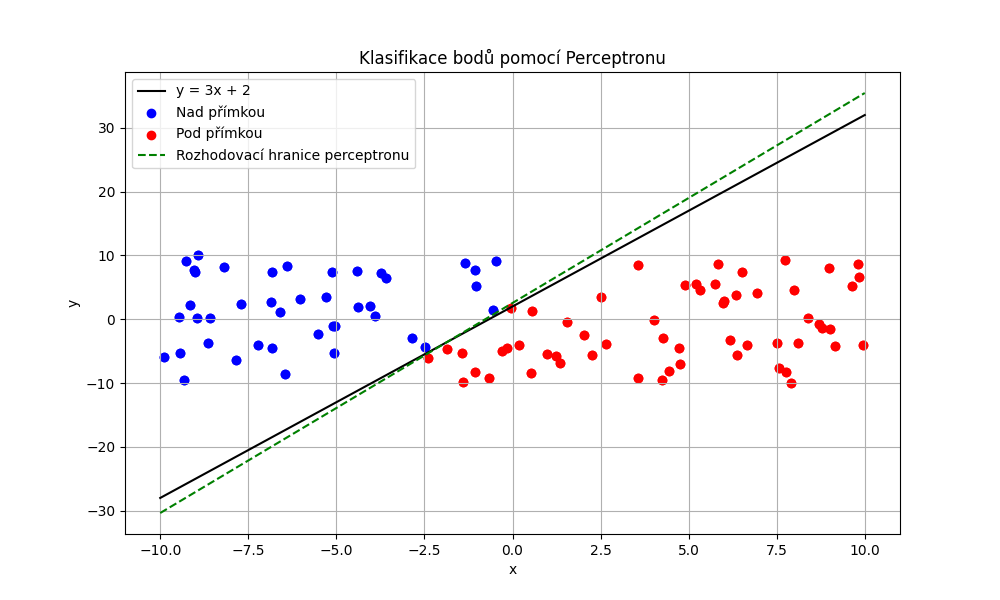
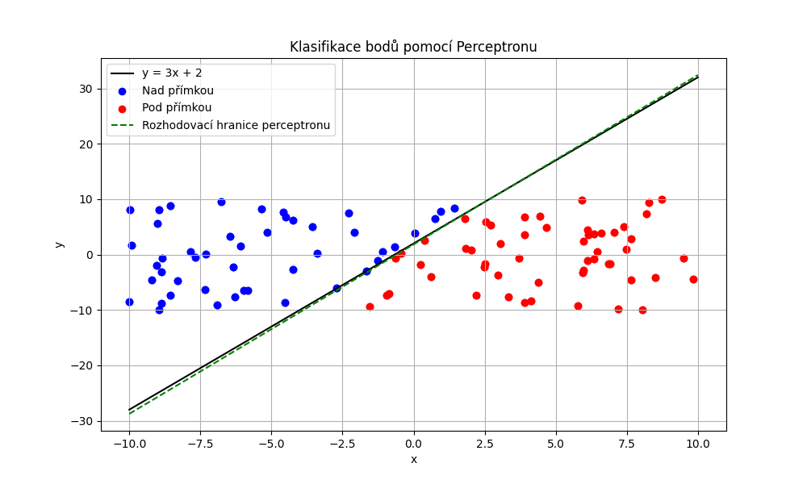
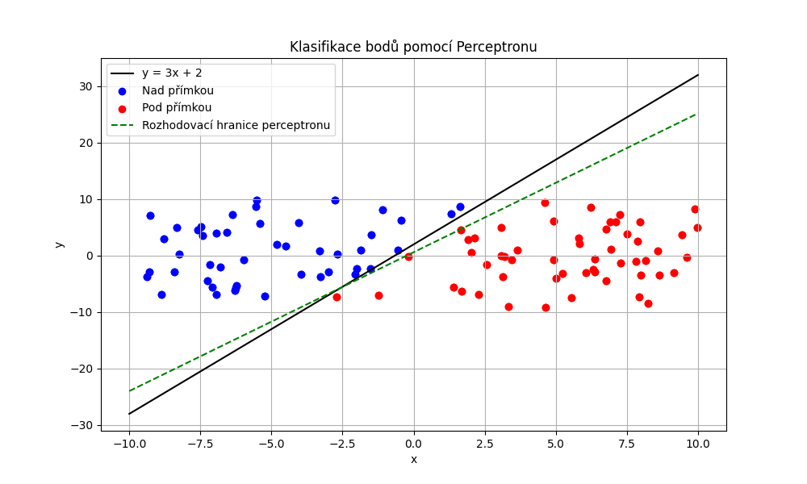

# Percepton pro binární klasifikaci

## Implementace

### Generování dat

Definice přímky je přímo banální.

```python
def line(x):
    return 3 * x + 2
```

Abychom mohli cokoliv trénovat, potřebujeme nějaká data a říct o nich, co jsou zač. V našem případě máme přímku
**y = 3x + 2** a body nad ní klasifikujeme jako 1 a pod ní jako -1. Body na přímce klasifikujeme jako -1. Podle toho,
jestli zvolíme ostrou nebo neostrou nerovnost, určíme jakým způsobem budeme klasifikovat body na přímce.

```python
def categorize_point(x, y):
    if y > line(x):
        return 1
    else:  # y <= line
        return -1
```

Potom už jen stačí vygenerovat nějaké body, řekneme kolik jich je a z jakého rozsahu mají být.

```python
def generate_points(num_points=100, x_range=(-10, 10), y_range=(-10, 10)):
    points = []
    for _ in range(num_points):
        x = random.uniform(x_range[0], x_range[1])
        y = random.uniform(y_range[0], y_range[1])
        label = categorize_point(x, y)
        points.append([x, y, label])
    return points
```

### Třída Perceptron

Aby bylo vše pěkně zabalené, vytvoříme třídu Perceptron.

```python
class Perceptron:
    def __init__(self, learning_rate=0.01):
        self.learning_rate = learning_rate
        self.weights = None
        self.bias = None
        self._randomize_weights_and_bias()
```

Ta bude mít metody pro trénink a klasifikaci. Třída si bude uchovávat váhy, bias a `learning_rate`. Váhy a bias
inicializujeme zatím neinicializujeme. To se děje v metodě `_randomize_weights_and_bias()`.

```python
def _randomize_weights_and_bias(self):
    self.weights = [random.uniform(-1, 1), random.uniform(-1, 1)]
    self.bias = random.uniform(-1, 1)
```

Rozsah od -1 do 1 je zvolen pro inicializaci vah a zkreslení, je symetrický kolem nuly, pomáhá s normalizací, zvyšuje
efektivitu a je standardním postupem v mnoha algoritmech strojového učení.

### Trénování

Stejně jako soupsta knihoven pro strojové učení voláme na data metodu `fit()`, která se postará o trénink
perceptronu. Jeho jediný parametr je počet iterací, které určuje, kolikrát se má procházet přes data. V každé iteraci
procházíme všechny body a pro každý bod zavoláme metodu `_update_weights_and_bias()`, která se postará o
aktualizaci vah a biasu.

```python
def fit(self, data, n_iters=100):
    for _ in range(n_iters):
        for point in data:
            self._update_weights_and_bias(point)         
```

Tato metoda provádí trénování perceptronu na vstupních datech. Funguje na principu iterativního průchodu všemi body
`n_iters`-krát. Během každé iterace se pro každý datový bod aktualizují váhy a bias voláním pomocné metody `_
update_weights_and_bias()`.

Princip aktualizace vah a biasu je jednoduchý a spočívá v:

1. výpočtu predikce pro daný bod: $ y_{pred} = w_1x + w_2y + b $,
2. Převedení na binární klasifikaci: $ y_{pred} = 1 $ pokud je predikce větší nebo rovna nule, jinak $ y_{pred} = -1 $,
3. Výpočtu aktualizace vah a biasu podle vzorce:

$ update = lr * (y - y_{pred}) $,

kde `lr` je learning rate, `y` je skutečná třída bodu a `y_{pred}` je predikce pro daný bod. Learning rate určuje, jak
moc
se mají váhy a bias aktualizovat. Čím větší je learning rate, tím rychleji se perceptron učí, ale může se stát, že se
naučí špatně. Čím menší je learning rate, tím pomaleji se perceptron učí, ale je pravděpodobnější, že se naučí správně.

Následně aktualizujeme váhy a bias podle vzorce:

$ w_i = w_i + update * x_i $ a $ b = b + update $,

kde `w_i` je i-tá váha, `x_i` je i-tá souřadnice bodu a `b` je bias, což je náhodná hodnota pomáhající s normalizací
a zvyšující efektivitu pro ty neurony, které by jinak měly nulovou aktivaci. Někdy se vyplatí dát těmto neurónům
šanci, mohou zlepšit celkovou přesnost modelu.

```python
def _update_weights_and_bias(self, point):
    x, y, label = point[0], point[1], point[2]

    prediction = self.weights[0] * x + self.weights[1] * y + self.bias
    if prediction >= 0:
        y_pred = 1
    else:
        y_pred = -1

    update = self.learning_rate * (label - y_pred)
    self.weights[0] += update * x
    self.weights[1] += update * y
    self.bias += update  
```

### Vizualizace a predikce

Pro vizualizaci dat a rozhodovací hranice použijeme knihovnu `matplotlib`. Funkce
`plot_results(X, y, perceptron, predictions)` vykreslí body podle jejich skutečné třídy a také zobrazí rozhodovací
hranici určenou naučenými váhami a biasem.

Třída `Perceptron` obsahuje metodu `predict()`, která využívá pomocnou metodu `_predict_point()` k výpočtu predikce pro
každý bod. Princip výpočtu je stejný jako v metodě `_update_weights_and_bias()`, pouze neprovádí aktualizaci vah.

## Výsledky

Rozhodovací hranice se vypočítá na základě naučených
vah ([podrobněji zde](https://thomascountz.com/2018/04/13/calculate-decision-boundary-of-perceptron)).

Po natrénování perceptron úspěšně rozděluje body do dvou tříd, přičemž naučená rozhodovací hranice přibližně odpovídá
původní přímce y = 3x + 2. Počet iterací (výchozí hodnota 1000) přímo ovlivňuje přesnost modelu. U hraničních bodů
může docházet k mírnému zkreslení v závislosti na velikosti bodu a způsobu klasifikace bodů ležících přímo na přímce.

Výsledky jsou ukládány do složky `results` s inkrementálním číslováním v názvu souborů:



