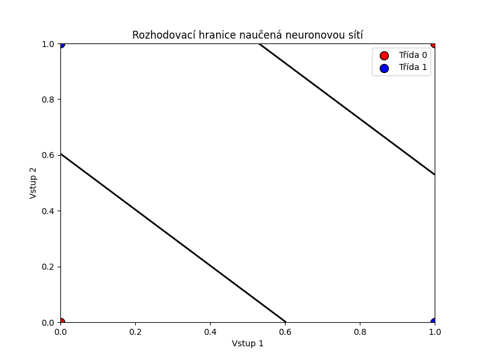

# Neuronová síť pro řešení problému XOR

## Implementace

Abychom mohli klasifikovat XOR problém, potřebujeme neuronovou síť se skrytou vrstvou. Představíme si tento problém jako
prostor, kdy v rohu čtverce máme hodnoty 0 a 1. Naše úloha je rozdělit tyto body do dvou skupin. Problém je, že
neexistuje žádná lineární funkce, která by mohla rozdělit tyto body do dvou skupin. Proto potřebujeme skrytou vrstvu,
která nám umožní modelovat nelineární vztah mezi vstupy a výstupy.

## Aktivační funkce

Aktivační funkce je matematická funkce, která určuje výstup neuronu na základě jeho vstupů. Jejím hlavním účelem je
zavést nelinearitu do neuronové sítě, což umožňuje modelovat komplexnější vztahy mezi vstupy a výstupy.
Bez nelineárních aktivačních funkcí by byla vícevrstvá neuronová síť ekvivalentní jediné vrstvě.

V této úloze použijeme sigmoidní aktivační funkci, která je definována jako:

$ sigmoid(x) = \frac{1}{1 + e^{-x}} $

```python
def sigmoid(x):
    return 1 / (1 + np.exp(-x))
```

D8le poytebujeme i její derivaci, která se používá při trénování sítě pomocí zpětné propagace:

$ sigmoid'(x) = x * (1 - x) $

Doslova to je jen derivace sigmoidní funkce. Používá se při výpočtu gradientu během trénování neuronové sítě. Gradient
je potřebný k tomu, abychom věděli, jak moc upravit váhy neuronové sítě, aby se minimalizovala chyba mezi skutečným a
očekávaným výstupem.

```python
def sigmoid_derivative(x):
    return x * (1 - x)
```

## Třída neuronové sítě

Třída `NeuralNetwork` představuje neuronovou síť, která se skládá z jedné skryté vrstvy a jedné výstupní vrstvy.

```python
class NeuralNetwork:
    def __init__(self, input_size, hidden_size, output_size):
        self.input_size = input_size
        self.hidden_size = hidden_size
        self.output_size = output_size

        # Inicializace vah a biasů náhodnými hodnotami
        self.weights_input_hidden = np.random.uniform(0.0, 1.0, size=(input_size, hidden_size))
        self.weights_hidden_output = np.random.uniform(0.0, 1.0, size=(hidden_size, output_size))
        self.bias_hidden = np.random.uniform(0.0, 1.0, size=(1, hidden_size))
        self.bias_output = np.random.uniform(0.0, 1.0, size=(1, output_size))
```

Při inicializaci jsou váhy a biasy nastaveny na náhodné hodnoty z intervalu **[0, 1]**. Pro tento jednoduchý příklad je
uniformní distribuce dostačující. Výstup sigmoidní funkce je v intervalu **(0, 1)**, což zajišťuje, že aktivace neuronů
budou v tomto rozmezí a snadněji interpretovatelné.

## Dopředná propagace

Metoda `forward_propagation` počítá výstup sítě na základě vstupů:

```python
def forward_propagation(self, input_data):
    hidden_layer_activation = np.dot(input_data, self.weights_input_hidden) + self.bias_hidden
    self.hidden_layer_output = sigmoid(hidden_layer_activation)

    # Výpočet výstupní vrstvy: kombinace výstupu skryté vrstvy, vah a biasu, následovaná aktivací
    output_layer_activation = np.dot(self.hidden_layer_output, self.weights_hidden_output) + self.bias_output
    self.output = sigmoid(output_layer_activation)

    return self.output
```

Co vlastně tato funkce dělá?

Tato metoda implementuje dopředný průchod (forward pass) neuronovou sítí, což je proces, při kterém se vstupní data
transformují přes jednotlivé vrstvy sítě až na výstup:

1. Nejprve se počítá aktivace skryté vrstvy: vstupní data se násobí vahami (`weights_input_hidden`) a přidává se bias (
   `bias_hidden`).
2. Na tuto aktivaci se aplikuje sigmoidní aktivační funkce, která převede hodnoty do rozmezí (0,1) pro skrytou vrstvu.
   Tímto způsobem se zavádí nelinearita do modelu, tedy komplexní vztahy mezi vstupy a výstupy.
3. Poté se počítá aktivace výstupní vrstvy: výstupy skryté vrstvy se násobí vahami (`weights_hidden_output`) a přidává
   se bias výstupní vrstvy (`bias_output`). To dodá smysl mezi důležitými prvky skryté vrstvy a výstupními neurony.
4. Znovu se aplikuje sigmoidní funkce pro získání konečného výstupu sítě.

Matematicky jde o sérii transformací:

$$
\begin{align}
z_{hidden} &= X \cdot W_{input\_hidden} + b_{hidden} \\
a_{hidden} &= sigmoid(z_{hidden}) \\
z_{output} &= a_{hidden} \cdot W_{hidden\_output} + b_{output} \\
output &= sigmoid(z_{output})
\end{align}
$$

## Zpětná propagace

Metoda `backward_propagation` provádí zpětný průchod neuronovou sítí, při kterém se na základě chyby mezi očekávaným a
skutečným výstupem upravují váhy a biasy:

```python
def backward_propagation(self, input_data, target_output, learning_rate):
    output_error = target_output - self.output

    output_gradient = output_error * sigmoid_derivative(self.output)
    hidden_layer_error = np.dot(output_gradient, self.weights_hidden_output.T)

    # Aktualizace vah a biasů pomocí gradientů a rychlosti učení
    hidden_layer_gradient = hidden_layer_error * sigmoid_derivative(self.hidden_layer_output)
    self.weights_hidden_output += np.dot(self.hidden_layer_output.T, output_gradient) * learning_rate
    self.weights_input_hidden += np.dot(input_data.T, hidden_layer_gradient) * learning_rate
    self.bias_output += np.sum(output_gradient) * learning_rate
    self.bias_hidden += np.sum(hidden_layer_gradient) * learning_rate
```

Co vlastně tato funkce dělá?

Tato metoda implementuje zpětný průchod (backward pass) neuronovou sítí, tedy proces učení sítě na základě chyb:

1. **Výpočet chyby výstupu**: Nejprve se zjistí rozdíl mezi požadovaným (`target_output`) a aktuálním výstupem sítě (
   `self.output`).
2. **Gradient výstupní vrstvy**: Tento rozdíl se násobí derivací sigmoidní funkce, čímž vzniká gradient chyby, který
   určuje směr úpravy vah.
3. **Chyba skryté vrstvy**: Chyba se šíří zpět do skryté vrstvy pomocí transponované matice vah mezi skrytou a výstupní
   vrstvou.
4. **Gradient skryté vrstvy**: I zde se použije derivace sigmoidní funkce, aby se určil vliv jednotlivých neuronů skryté
   vrstvy na chybu.
5. **Aktualizace vah a biasů**: Pomocí vypočtených gradientů a nastavené rychlosti učení (`learning_rate`) se upravují
   váhy a biasy, čímž se síť učí produkovat přesnější výstupy.

## Trénování sítě

Metoda `train` provádí trénování neuronové sítě na základě zadaných vstupních dat a cílových výstupů:

```python
def train(self, input_data, target_output, learning_rate, epochs):
    for epoch in range(epochs):
        self.forward_propagation(input_data)
        self.backward_propagation(input_data, target_output, learning_rate)
```

V podstatě se jedná o cyklus, který opakuje dopřednou a zpětnou propagaci po zadaný počet epoch. Každá epocha
znamená jeden průchod celým tréninkovým datasetem. V každé epoše se síť učí na základě aktuálních vstupních dat a
cílových výstupů. Pro ukázju vah je připravená metoda `print_weights_biases`.

## Predikce a vyhodnocení

Poté se pouze zavolá metoda `predict`, která vrátí výstup sítě pro daný vstup. V podstatě zavolá metodu
`forward_propagation`.

Pro vizualizace je připravená metoda `plot_decision_boundary`.

```python
def predict(self, input_data):
    return self.forward_propagation(input_data)
```

Pak jen v **main** funkci zavoláme definujeme XOR tabulku a zinicializujeme neuronovou síť:

```python
input_data = np.array([[0, 0], [0, 1], [1, 0], [1, 1]])
target_output = np.array([[0], [1], [1], [0]])

input_size = 2
hidden_size = 2
output_size = 1
network = NeuralNetwork(input_size, hidden_size, output_size)
```

Tam jsou implementované pouze drobnosti. Pro každou možnou kombinaci v XOR tabulce se spočítá výstup a
porovná se s očekávaným výstupem.

```python
correct = 0
total = len(input_data)  # počet XOR kombinací
for i in range(total):
    prediction = network.predict(input_data[i].reshape(1, -1))
    expected = target_output[i][0]
    is_correct = (round(prediction[0, 0]) == expected)
    correct += is_correct

    print(f"Hádaný výstup {prediction[0, 0]:.12f}   Očekávaný výstup {expected}   Je to správně? {is_correct}")
```

## Výsledky

Ukázku trénovaní lze vidět v souboru [zde](results/console_output.txt). Výslednou hranici rozhodování lze vidět na
obrázku níže. Jednotlivé rohy jsou binární výsledky. Proto jsme museli použít skrytou vrstvu, abychom
mohli modelovat nelineární vztah mezi vstupy a výstupy. Neexistuje žádná lineární funkce, která by mohla
rozdělit tyto body do dvou skupin.

