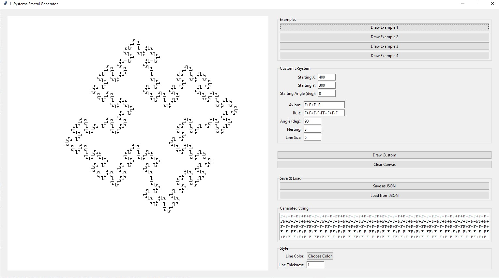

# L-systémy Fraktály

## Funkce aplikace

1. **Přetahování plátna**: Plátno lze přetahovat myší pro lepší manipulaci s vykreslenými fraktály.
2. **Vykreslení více fraktálů**: Aplikace umožňuje vykreslit více fraktálů na jedno plátno.
3. **Ukládání a načítání**: L-systémy lze ukládat do JSON souborů a z nich je opět načítat.
4. **Vlastní styl**: Možnost nastavit barvu a tloušťku čáry.

## Implementace

### Přetahování plátna

Plátno lze přetahovat pomocí myši. Tato funkce je implementována pomocí metod `start_drag` a `do_drag`.

```python
def start_drag(self, event):
    """Zahájení přetahování plátna."""
    self.drag_data["x"] = event.x
    self.drag_data["y"] = event.y


def do_drag(self, event):
    """Zpracování přetahování plátna."""
    dx = event.x - self.drag_data["x"]
    dy = event.y - self.drag_data["y"]
    self.canvas.move("all", dx, dy)
    self.drag_data["x"] = event.x
    self.drag_data["y"] = event.y
```

### Generování řetězce L-systému

Generování řetězce L-systému je implementováno v metodě `generate_l_string`. Tato metoda začíná s axiomem a iterativně
aplikuje pravidla přepisování na každý znak v řetězci.

```python
def generate_l_string(self, axiom, rule, nesting):
    # Odstranění mezer kolem znaku '>' a odstranění počátečních/trailing mezer
    rule = rule.strip().replace(" >", ">").replace("> ", ">")
    current = axiom
    rule_from, rule_to = rule.split(">") if ">" in rule else ("F", "")

    for _ in range(nesting):
        next_str = []
        for char in current:
            if char == rule_from:
                next_str.append(rule_to)
            else:
                next_str.append(char)
        current = "".join(next_str)

    return current
```

#### Princip

1. **Axiom**: Počáteční řetězec, který slouží jako základ pro generování.
2. **Pravidlo přepisování**: Definováno ve formátu `F>F+F-F-FF+F+F-F`, kde `F` je nahrazováno výrazem za `>`.
3. **Iterace**: Počet iterací (vnoření), během kterých se pravidla aplikují na aktuální řetězec.

Každý znak v řetězci je nahrazen podle pravidla. Pokud znak neodpovídá levé straně pravidla, zůstává nezměněn.

### Vykreslování L-systému

Metoda `draw_l_string` interpretuje vygenerovaný řetězec jako sérii příkazů pro kreslení na plátno.

```python
def draw_l_string(self, l_string, angle, line_length, start_x, start_y, start_angle):
    # Vykreslení řetězce L-systému na plátno s podporou barvy a tloušťky čáry
    x, y = start_x, start_y
    current_angle = start_angle
    stack = []
    color = self.color_var.get()
    thickness = self.thickness_var.get()

    for char in l_string:
        if char == 'F':
            # Kreslení čáry vpřed
            new_x = x + line_length * math.cos(current_angle)
            new_y = y + line_length * math.sin(current_angle)
            self.canvas.create_line(x, y, new_x, new_y, fill=color, width=thickness)
            x, y = new_x, new_y
        elif char == 'b':
            # Posun vpřed bez kreslení
            new_x = x + line_length * math.cos(current_angle)
            new_y = y + line_length * math.sin(current_angle)
            x, y = new_x, new_y
        elif char == '+':
            # Otočení doprava
            current_angle -= angle
        elif char == '-':
            # Otočení doleva
            current_angle += angle
        elif char == '[':
            # Uložení aktuálního stavu na zásobník
            stack.append((x, y, current_angle))
        elif char == ']':
            # Obnovení stavu ze zásobníku
            if stack:
                x, y, current_angle = stack.pop()
```

#### Interpretace znaků

- **F**: Nakreslí čáru ve směru aktuálního úhlu.
- **b**: Posune se vpřed bez kreslení.
- **+**: Otočí se doprava o zadaný úhel.
- **-**: Otočí se doleva o zadaný úhel.
- **[**: Uloží aktuální pozici a úhel na zásobník.
- **]**: Obnoví pozici a úhel ze zásobníku.

#### Zásobník

Zásobník umožňuje vykreslování větvených struktur, jako jsou stromy nebo rostliny. Uložením a obnovením pozice a úhlu
se želva může vrátit na předchozí místo a pokračovat v kreslení jiným směrem.

### Ukládání a načítání L-systémů

Aplikace umožňuje ukládat a načítat L-systémy ve formátu JSON. To umožňuje snadné sdílení a opětovné použití
definovaných
L-systémů.

#### Ukládání

```python
def save_lsystem(self):
    lsystem_data = {
        "axiom": self.axiom_var.get(),
        "rule": self.rule_var.get(),
        "angle": self.angle_var.get(),
        "nesting": self.nesting_var.get(),
        "line_size": self.line_size_var.get(),
        "start_x": self.start_x_var.get(),
        "start_y": self.start_y_var.get(),
        "start_angle": self.start_angle_var.get()
    }
    ...
```

#### Načítání

```python
def load_lsystem(self):
    with open(filepath, 'r') as f:
        lsystem_data = json.load(f)
    ...
```

### Podpora vlastního stylu

Aplikace umožňuje nastavit barvu a tloušťku čáry, což zvyšuje flexibilitu při vykreslování.

```python
def choose_color(self):
    color_code = askcolor(title="Choose Line Color")[1]
    if color_code:
        self.color_var.set(color_code)
```

## Příklady

1. **Příklad 1**
    - **Axiom**: `F+F+F+F`
    - **Pravidlo**: `F > F+F-F-FF+F+F-F`
    - **Úhel**: `90°`

2. **Příklad 2**
    - Axiom: `F++F++F`
    - Pravidlo: `F > F+F--F+F`
    - Úhel: `60°`

3. **Příklad 3**
    - Axiom: `F+F+F+F`
    - Pravidlo: `F > FF+F++F+F`
    - Úhel: `90°`

4. **Příklad 4**
    - Axiom: `F+XF+F+XF`
    - Pravidlo: `X > XF-F+F-XF+F+XF-F+F-X`
    - Úhel: `90°`

## Výsledky

### První příklad



### Druhý příklad


### Třetí příklad


### Čtvrtý příklad


