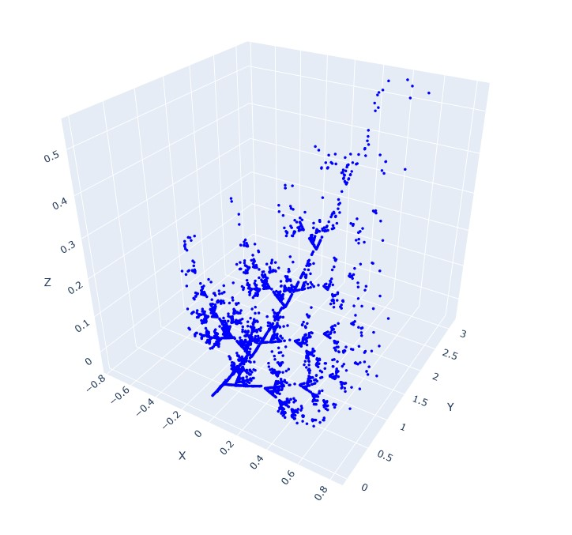
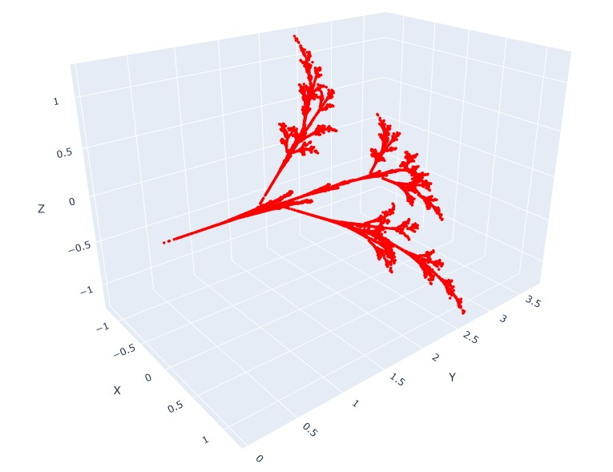

# Fraktálový Generátor IFS

Tento projekt implementuje generátor fraktálů založený na Iterovaných Funkčních Systémech (IFS). Pomocí sady
transformačních funkcí lze generovat různé fraktální vzory a vizualizovat je ve 3D.

## Funkce

### Definice transformací

Funkce `define_transformations()` vrací dvě sady transformací, které určují vlastnosti fraktálů. Každá transformace je
popsána 12 parametry (a až l), které definují lineární transformaci v 3D prostoru:

```python
x_new = a * x + b * y + c * z + j
y_new = d * x + e * y + f * z + k
z_new = g * x + h * y + i * z + l
```

### Generování bodů

Funkce `generate_points()` implementuje algoritmus náhodné iterace:

1. Začíná s bodem (0,0,0).
2. Náhodně vybírá transformaci a aplikuje ji na aktuální bod.
3. Výsledný bod ukládá do historie.
4. Opakuje proces pro zadaný počet iterací.

Každá sada transformací generuje vlastní sadu bodů.

### Vykreslení 3D modelu

Funkce `plot_model()` vizualizuje vygenerované body pomocí knihovny Plotly. Výstupem je interaktivní 3D graf s možností
rotace a přiblížení.

## Použití

1. Definujte transformace pomocí `define_transformations()`.
2. Generujte body pomocí `generate_points(transformations, iterations)`.
3. Vizualizujte výsledky pomocí `plot_model(history, title)`.

## Výsledky

### Fraktál 1



### Fraktál 2


