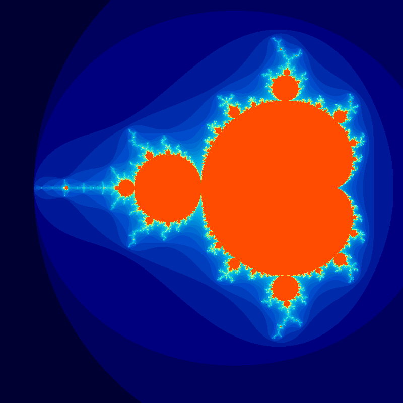
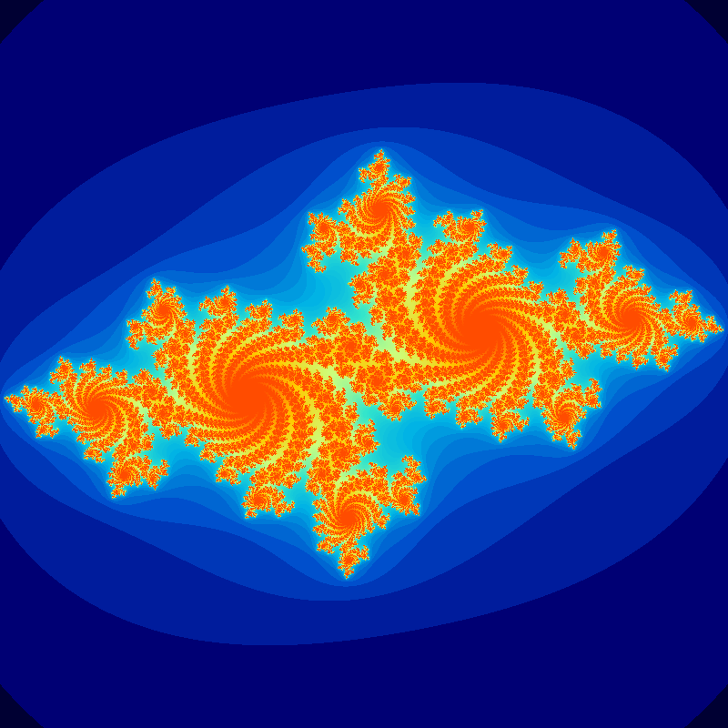

# Generátor Fraktálů Mandelbrotovy a Juliovy Množiny

## Klíčové Funkce

### Výpočet Mandelbrotovy Množiny

Funkce `mandelbrot(c, max_iter)` počítá, zda komplexní číslo `c` patří do Mandelbrotovy množiny. Používá iterační vzorec
`z = z*z + c`, začínající s `z = 0`. Funkce vrací počet iterací, než absolutní hodnota `z` překročí 2 (bod unikl), nebo
`max_iter`, pokud bod zůstává omezený (patří do množiny).

```python
def mandelbrot(c, max_iter):
    """
    Vypočítá počet iterací pro bod c v Mandelbrotově množině.
    Vrací počet iterací, než |z| > 2, nebo max_iter, pokud bod patří do množiny.
    """
    z = 0
    for n in range(max_iter):
        if abs(z) > 2:  # Bod unikl z kruhu s poloměrem 2
            return n
        z = z * z + c
    return max_iter  # Bod patří do množiny
```

### Výpočet Juliovy Množiny

Funkce `julia(z, c, max_iter)` počítá, zda komplexní číslo `z` patří do Juliovy množiny definované konstantou `c`.
Používá stejný iterační vzorec `z = z*z + c`, ale `z` je počáteční bod a `c` je konstanta pro celou množinu. Vrací počet
iterací, než `|z| > 2`, nebo `max_iter`.

```python
def julia(z, c, max_iter):
    """
    Vypočítá počet iterací pro bod z v Juliově množině s konstantou c.
    Vrací počet iterací, než |z| > 2, nebo max_iter.
    """
    for n in range(max_iter):
        if abs(z) > 2:  # Bod unikl a nepatří do množiny
            return n
        z = z * z + c
    return max_iter  # Bod patří do množiny
```

### Generování Dat Fraktálu

Funkce `create_fractal()` generuje 2D pole (obrázek), kde hodnota každého pixelu odpovídá počtu iterací vypočítaných
funkcí `mandelbrot` nebo `julia` pro daný bod v komplexní rovině. Mapuje souřadnice pixelů na komplexní čísla v zadaném
rozsahu (`xmin`, `xmax`, `ymin`, `ymax`).

```python
def create_fractal(width, height, xmin, xmax, ymin, ymax, max_iter=256, fractal_type='mandelbrot', c=None):
    """
    Generuje 2D pole reprezentující fraktál (Mandelbrotův nebo Juliův).
    Každý prvek pole obsahuje počet iterací pro daný bod komplexní roviny.
    """
    # ... implementace ...
    return img
```

### Vytváření Animace a Statického Snímku

Funkce `create_high_quality_animation()` orchestruje generování sekvence snímků pro vytvoření zoomovací animace.

1. **Inicializace**: Nastaví parametry jako rozměry, střed zoomu (`center`), počáteční přiblížení (`initial_zoom`),
   faktor zoomu (`zoom_factor`), počet snímků (`num_frames`) a maximální počet iterací (`max_iter`).
2. **První Snímek**: Vygeneruje první snímek pomocí `create_fractal` s počátečním zoomem. Tento snímek je uložen jako
   samostatný PNG soubor pro statickou ukázku.
3. **Generování Snímků Animace**: V cyklu generuje další snímky, přičemž pro každý snímek upravuje rozsah komplexní
   roviny podle `zoom_factor`, čímž simuluje přibližování.
4. **Zpracování Barev**: Pro lepší vizuální kontrast aplikuje logaritmickou škálu na počet iterací a normalizuje
   hodnoty. Používá vlastní barevnou mapu (`cmap`) pro obarvení snímků.
5. **Sestavení GIFu**: Pomocí knihovny `imageio` sestaví jednotlivé obarvené snímky do výsledného GIF souboru.

```python
def create_high_quality_animation(width, height, center, initial_zoom, zoom_factor, num_frames, max_iter=256,
                                  fractal_type='mandelbrot', c=None, output_path='output.gif'):
    """Vytváří animaci (GIF) zoomování do fraktálu a ukládá úvodní snímek jako PNG."""
    # ... implementace ...
```

## Použití

Skript se spouští přímo. V bloku `if __name__ == '__main__':` jsou definovány parametry pro generování Mandelbrotovy a
Juliovy množiny:

- `width`, `height`: Rozměry výstupních obrázků/animací.
- `max_iter`: Maximální počet iterací pro výpočet fraktálu. Vyšší hodnota znamená detailnější fraktál, ale delší
  výpočet.
- `num_frames`: Počet snímků v animaci.
- `center`: Komplexní číslo (tuple `(re, im)`), které určuje střed zoomu.
- `initial_zoom`: Počáteční "poloměr" pohledu v komplexní rovině.
- `zoom_factor`: Faktor přiblížení pro každý snímek animace (hodnota < 1 znamená přibližování).
- `c`: Komplexní konstanta pro Juliovu množinu.
- `output_path`: Cesta pro uložení výsledného GIF souboru a PNG snímku.

Výsledky se ukládají do adresáře `results`.

```python
if __name__ == '__main__':
    width, height = 800, 800
    max_iter = 256
    num_frames = 125

    results_dir = "results"
    # ... vytvoření adresáře ...

    print("Vytvářím vylepšený Mandelbrotův zoom...")
    create_high_quality_animation(
        # ... parametry pro Mandelbrota ...
        output_path=os.path.join(results_dir, 'mandelbrot.gif')
    )

    print("Vytvářím vylepšený Juliův zoom...")
    create_high_quality_animation(
        # ... parametry pro Julii ...
        c=complex(-0.7, 0.27015),
        output_path=os.path.join(results_dir, 'julia.gif')
    )
```

## Výsledky

Výstupem skriptu jsou dva GIF soubory (`mandelbrot.gif`, `julia.gif`) a dva PNG soubory (`mandelbrot.png`, `julia.png`)
uložené v adresáři `results`.

### Mandelbrotova Množina (Zoom)

### Statický snímek



### Animace


### Juliova Množina (Zoom)

### Statický snímek



### Animace


