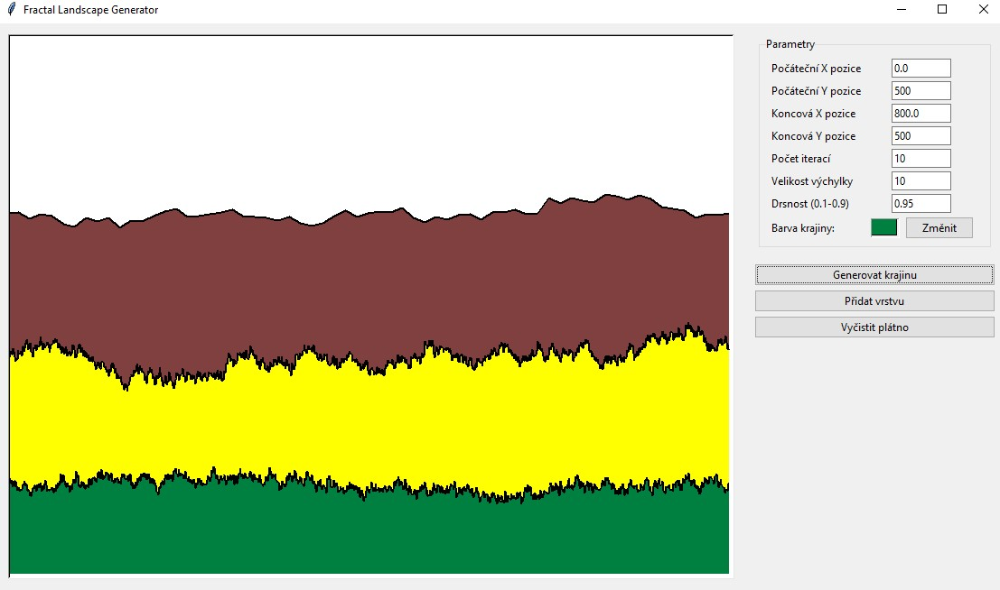
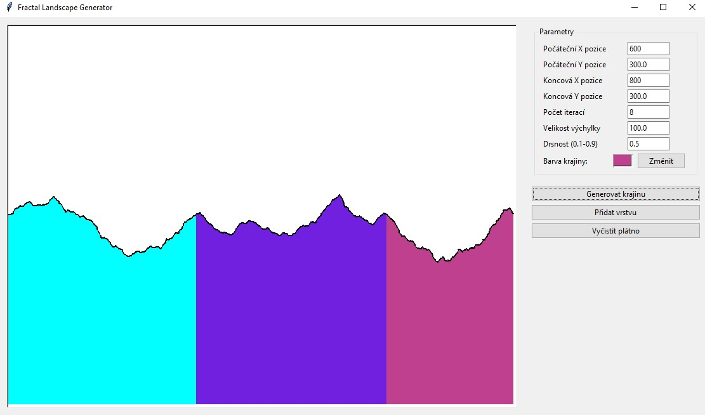

# Generátor Fraktální Krajiny

Implementace generátoru fraktální krajiny pomocí midpoint displacement metody.

## Princip Midpoint Displacement

Algoritmus generuje fraktální krajinu metodou půlení úseček s náhodným posunutím:

```python
def fractal_landscape(self, iterations, start_x, start_y, end_x, end_y, height_variation, roughness=0.5):
    landscape = [(start_x, start_y), (end_x, end_y)]  # Počáteční přímka

    for _ in range(iterations):
        new_landscape = []
        for i in range(len(landscape) - 1):
            x1, y1 = landscape[i]
            x2, y2 = landscape[i + 1]

            # Středový bod
            mid_x = (x1 + x2) / 2
            mid_y = (y1 + y2) / 2

            # Náhodné posunutí středu
            if random.random() < 0.5:
                mid_y += random.uniform(0, height_variation)
            else:
                mid_y -= random.uniform(0, height_variation)

            new_landscape.append((x1, y1))
            new_landscape.append((mid_x, mid_y))

            if i == len(landscape) - 2:
                new_landscape.append((x2, y2))

        landscape = new_landscape
        # Zmenšení výchylky s každou iterací
        height_variation *= roughness

    return landscape
```

### Princip Algoritmu:

1. **Inicializace**: Začíná s přímkou mezi dvěma body.
2. **Iterativní Dělení**: Pro každou iteraci najde středový bod každé úsečky a náhodně jej posune.
3. **Řízení Drsnosti**: Parametr `roughness` určuje, jak rychle se zmenšuje velikost náhodného posunu:
    - Hodnoty blízké 1 vytváří hladší křivky.
    - Nižší hodnoty vytváří drsnější, nepravidelnější křivky.

### Matematický Princip

Metoda půlení úseček vytváří sebepodobný fraktál. Klíčové vlastnosti:

- **Škálování náhodnosti**: S každou iterací se velikost náhodného posunu zmenšuje: `height_variation *= roughness`
- **Statistické vlastnosti**: Parametr drsnosti (`roughness`) souvisí s Hurstovým exponentem (H) a fraktální dimenzí (
  D): `D = 2 - H`, což jednoduše řečeno znamená, že čím menší drsnost, tím nepravidelnější a "roztřesenější" bude
  krajina

### Vykreslování Krajiny

Pro vykreslení krajiny se používá uzavřený polygon:

```python
def _draw_layer(self, layer):
    points = []
    for x, y in layer['points']:
        points.extend([x, y])

    # Uzavřený polygon pro výplň
    fill_points = list(points)
    fill_points.extend([layer['end_x'], self.canvas_height])
    fill_points.extend([layer['start_x'], self.canvas_height])

    # Vykreslení
    self.canvas.create_polygon(fill_points, fill=layer['color'], outline="")
    self.canvas.create_line(points, fill="black", width=2)
```

## Klíčové Parametry

Chování algoritmu určují tyto parametry:

1. **Počet iterací**: Určuje detail a složitost výsledné křivky.
2. **Výchylka (height_variation)**: Maximální náhodná změna výšky v první iteraci.
3. **Drsnost (roughness)**: Určuje rychlost zmenšování náhodné výchylky:
    - Hodnoty 0.8-0.9: Hladší, plynulejší krajiny
    - Hodnoty 0.4-0.5: Drsnější, zubaté krajiny
    - Hodnoty < 0.3: Chaotické, nerealistické tvary

## Vícevrstvé Krajiny

Aplikace podporuje generování více vrstev krajiny, což umožňuje vytvářet komplexnější vizuální výstupy:

```python
def add_layer(self):
    if not self.landscape_points:
        return

    layer = {
        'points': self.landscape_points.copy(),
        'color': self.landscape_color,
        'start_x': self.start_x.get(),
        'end_x': self.end_x.get()
    }
    self.saved_layers.append(layer)

    self.draw_landscape(preserve_existing=True)
    self.landscape_points = []
```

## Výsledky

### Krajina 1



### Krajina 2

