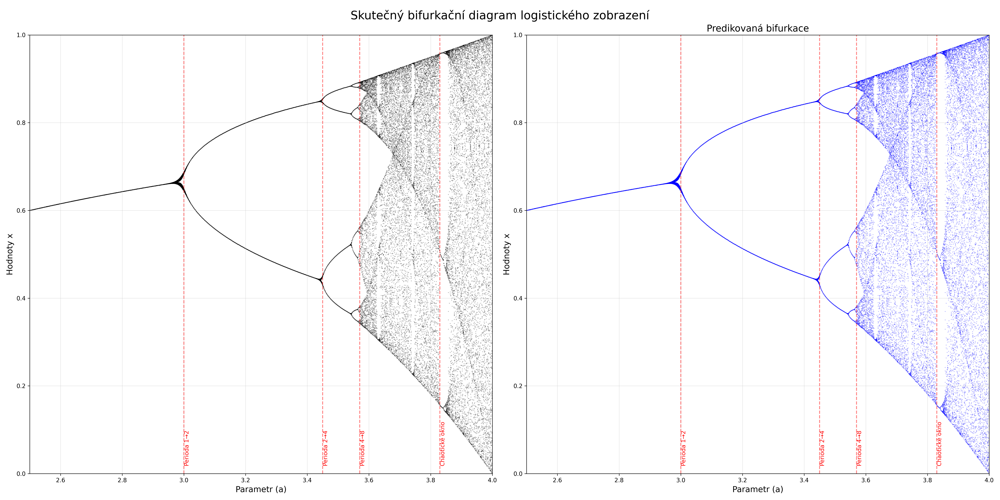

# Neuronová síť pro predikci bifurkačního diagramu

## Úvod

Tento projekt implementuje neuronovou síť, která predikuje bifurkační diagram logistického zobrazení. Tento nelineární
dynamický systém může vykazovat deterministické i chaotické chování v závislosti na hodnotě řídícího parametru.

## Logistické zobrazení

Logistické zobrazení je definováno rekurentní funkcí:

```
x_{n+1} = a * x_n * (1 - x_n)
```

kde:

- `a` je řídicí parametr (zkoumáme rozsah 2.5 - 4.0)
- `x_n` je hodnota v rozmezí [0, 1]

Tato funkce vykazuje rozdílné chování v závislosti na parametru `a`:

- Pro `a < 3.0`: konvergence k jedné hodnotě (perioda 1)
- Pro `3.0 < a < 3.45`: oscilace mezi dvěma hodnotami (perioda 2)
- Pro `3.45 < a < 3.57`: oscilace mezi čtyřmi hodnotami (perioda 4)
- Pro `a > 3.57`: kaskáda zdvojování period až do chaotického režimu

## Klíčové algoritmy

### Generování dat pro bifurkační diagram

```python
def generate_bifurcation_data(a_values, n_iterations=100, n_discard=100):
    """Generování dat pro bifurkační diagram"""
    x = np.zeros((len(a_values), n_iterations))

    for i, a in enumerate(a_values):
        x_val = 0.5

        # Zahození přechodových iterací
        for _ in range(n_discard):
            x_val = logistic_map(x_val, a)

        # Sběr stabilních hodnot
        for j in range(n_iterations):
            x_val = logistic_map(x_val, a)
            x[i, j] = x_val

    return x
```

Tato funkce:

1. Zahájí výpočet s počáteční hodnotou 0.5
2. Provede n_discard iterací, které zahodí, aby se systém stabilizoval
3. Následně zachytí n_iterations hodnot pro každý parametr `a`

### Trénování neuronové sítě

```python
def train_neural_network(X, y):
    """Trénink neuronové sítě"""
    scaler = StandardScaler()
    X_scaled = scaler.fit_transform(X)
    X_train, X_test, y_train, y_test = train_test_split(
        X_scaled, y, test_size=0.2, random_state=42
    )

    mlp = MLPRegressor(
        hidden_layer_sizes=(100, 200, 100),
        activation='relu',
        solver='adam',
        batch_size=32,
        learning_rate='adaptive',
        max_iter=1_000,
        early_stopping=False,
        random_state=42
    )

    mlp.fit(X_train, y_train)
    return mlp, scaler
```

Struktura neuronové sítě:

- Vstup: 1 neuron (parametr `a`)
- Skryté vrstvy: (100, 200, 100) neuronů
- Výstup: n_iterations neuronů (predikované hodnoty)
- Aktivační funkce: ReLU
- Optimalizátor: Adam

### Vyhodnocení kvality predikce

```python
def analyze_prediction_quality(a_values, actual_data, predicted_data):
    """Analýza kvality predikce"""
    errors = np.zeros(len(a_values))

    for i in range(len(a_values)):
        actual_sorted = np.sort(actual_data[i])
        pred_sorted = np.sort(predicted_data[i])
        errors[i] = np.mean(np.abs(actual_sorted - pred_sorted))

    # ...vytvoření grafu chyby...

    return fig, errors
```

Funkce pro každou hodnotu parametru `a` počítá průměrnou absolutní chybu mezi seřazenými skutečnými a predikovanými
hodnotami.

## Experiment a výsledky

Hlavní funkce orchestruje celý proces:

```python
def main():
    n_a_values = 1000
    a_values = np.linspace(2.5, 4.0, n_a_values)

    # Generování dat
    bifurcation_data = generate_bifurcation_data(a_values)

    # Trénink a predikce
    X = a_values.reshape(-1, 1)
    mlp, scaler = train_neural_network(X, bifurcation_data)
    predicted_bifurcation = mlp.predict(scaler.transform(X))

    # Vyhodnocení a analýza
    # ...vykreslení grafů a ukládání výsledků...
```

### Výsledky

1. **Skutečný bifurkační diagram**
   

2. **Porovnání skutečného a predikovaného diagramu**
   

3. **Analýza chyby predikce**
   

## Závěr

Neuronová síť relativně přesně predikuje bifurkační diagram v oblastech s jednodušším chováním (perioda 1 a 2). V
chaotických oblastech (pro `a > 3.57`) je predikce méně přesná, což odpovídá komplexní povaze systému v těchto režimech.

Analýza chyby ukazuje, že největší nepřesnosti se vyskytují v bodech přechodů mezi periodami a v chaotickém režimu.
